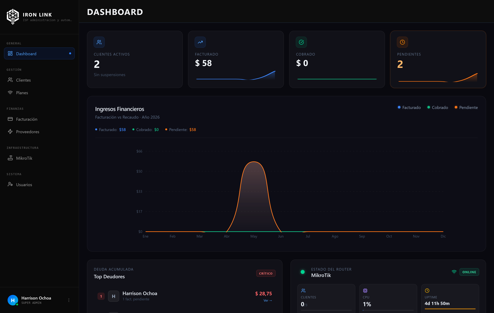
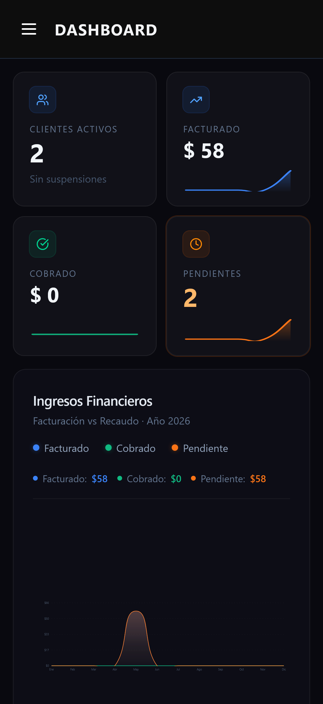

# ISPgestor Admin

[](#)
[](https://kit.svelte.dev/)
[](https://svelte.dev/)
[](https://www.typescriptlang.org/)
[](https://tailwindcss.com/)

Panel de administración web para la gestión integral de proveedores de servicios de internet (ISP). Construido con SvelteKit 5 y TailwindCSS, ofrece una interfaz moderna, reactiva y en tiempo real para administrar clientes, facturación, routers MikroTik, soporte y más.

---

## Capturas de pantalla

| Vista escritorio | Vista móvil |
|:---:|:---:|
|  |  |

---

## Tabla de contenidos

- [Descripción y arquitectura](#descripción-y-arquitectura)
- [Requisitos previos](#requisitos-previos)
- [Instalación y configuración](#instalación-y-configuración)
- [Variables de entorno](#variables-de-entorno)
- [Scripts disponibles](#scripts-disponibles)
- [Estructura de carpetas](#estructura-de-carpetas)
- [Dependencias](#dependencias)
- [Guía de uso](#guía-de-uso)
- [Documentación de la API consumida](#documentación-de-la-api-consumida)
- [Autenticación](#autenticación)
- [Despliegue en producción](#despliegue-en-producción)
- [Troubleshooting](#troubleshooting)
- [Contribución](#contribución)
- [Licencia](#licencia)

---

## Descripción y arquitectura

ISPgestor Admin es el frontend del sistema ISPgestor. Se comunica con el backend Laravel (`ispgestorserver`) a través de una API REST y mantiene una conexión WebSocket persistente para actualizaciones en tiempo real.

### Stack tecnológico

| Capa | Tecnología | Versión |
|------|-----------|---------|
| Framework | SvelteKit | ^2.43.2 |
| Lenguaje reactivo | Svelte | ^5.39.5 |
| Bundler | Vite | ^7.1.7 |
| CSS | TailwindCSS | ^4.1.13 |
| Componentes UI | Skeleton UI | ^4.7.4 |
| Tipado | TypeScript | ^5.9.2 |
| WebSocket | Laravel Echo + Pusher.js | ^1.16.1 / ^8.4.0 |
| PDF | jsPDF + autotable | ^3.0.4 / ^5.0.2 |
| Gráficas | Recharts | ^3.3.0 |
| Iconos | Lucide Svelte | ^0.546.0 |
| Notificaciones | Svelte Sonner | ^1.0.7 |
| Testing | Vitest | ^4.1.5 |
| Linting | ESLint | ^9.36.0 |
| Adaptador | @sveltejs/adapter-node | ^5.5.4 |

### Flujo de datos

```
Navegador
   │
   ├─► SvelteKit (SSR/CSR híbrido)
   │       │
   │       ├─► API REST  ──────► ispgestorserver (Laravel 12)
   │       │   (Bearer token)         │
   │       │                          ├─► MySQL
   │       │                          ├─► Queue (jobs)
   │       │                          └─► MikroTik RouterOS
   │       │
   │       └─► WebSocket ──────► Laravel Reverb (ws://)
   │           (protocolo Pusher)  (mensajes en tiempo real)
   │
   └─► localStorage (token de empleado)
```

---

## Requisitos previos

- **Node.js** >= 18.x (se recomienda la versión LTS)
- **npm** >= 9.x
- Backend **[ispgestorserver](../ispgestorserver)** corriendo y accesible
- Servidor **Laravel Reverb** activo para las funciones de chat en tiempo real

---

## Instalación y configuración

### 1. Clonar el repositorio

```bash
git clone <url-del-repositorio>
cd ispgestoradmin
```

### 2. Instalar dependencias

```bash
npm install
```

### 3. Configurar variables de entorno

```bash
cp .env.example .env
```

Edita `.env` con los valores de tu entorno (ver [Variables de entorno](#variables-de-entorno)).

### 4. Ejecutar en modo desarrollo

```bash
npm run dev
```

La aplicación estará disponible en `http://localhost:5173`.

### 5. Construir para producción

```bash
npm run build
```

Los archivos compilados quedan en `build/`. Para iniciarlos:

```bash
node build/index.js
```

---

## Variables de entorno

Copia `.env.example` a `.env` y ajusta cada valor:

```env
# URL base de la API del backend (sin trailing slash)
PUBLIC_API_BASE=http://127.0.0.1:8000/api

# Credenciales de Laravel Reverb (WebSocket en tiempo real)
VITE_REVERB_APP_KEY=isp-chat-key
VITE_REVERB_HOST=localhost
VITE_REVERB_PORT=8080
VITE_REVERB_SCHEME=http   # Usar "https" en producción con WSS
```

### Descripción de cada variable

| Variable | Descripción | Ejemplo producción |
|----------|-------------|-------------------|
| `PUBLIC_API_BASE` | URL base de la API REST del backend | `https://api.tudominio.com/api` |
| `VITE_REVERB_APP_KEY` | Clave de la app en Laravel Reverb | `mi-clave-produccion` |
| `VITE_REVERB_HOST` | Host del servidor WebSocket | `api.tudominio.com` |
| `VITE_REVERB_PORT` | Puerto WebSocket | `443` |
| `VITE_REVERB_SCHEME` | Protocolo (`http`/`https`) | `https` |

> **Nota:** Las variables con prefijo `PUBLIC_` son accesibles en el navegador. Las variables `VITE_*` se inyectan en el bundle durante el build, no en runtime del servidor.

> **Importante:** Si `PUBLIC_API_BASE` está vacío en producción, la aplicación lanzará un error deliberado al intentar hacer peticiones. Configura siempre esta variable antes del build.

---

## Scripts disponibles

| Script | Descripción |
|--------|-------------|
| `npm run dev` | Servidor de desarrollo con hot reload |
| `npm run build` | Compilar para producción |
| `npm run preview` | Previsualizar el build de producción localmente |
| `npm run prepare` | Sincronizar tipos generados por SvelteKit |
| `npm run check` | Verificar tipos TypeScript |
| `npm run check:watch` | Verificar tipos en modo watch |
| `npm run lint` | Lint del código |
| `npm test` | Ejecutar suite de tests con Vitest |

---

## Estructura de carpetas

```
ispgestoradmin/
├─ src/
│  ├─ routes/                          # Páginas y rutas (file-based routing de SvelteKit)
│  │  ├─ +layout.svelte               # Layout raíz (navegación y sidebar global)
│  │  ├─ +page.svelte                 # Dashboard principal (KPIs, gráficas, resumen)
│  │  ├─ login/                        # Login para empleados
│  │  ├─ admin/login/                  # Login alternativo para administradores
│  │  ├─ clientes/                     # Gestión de clientes (CRUD, filtros, estado)
│  │  ├─ facturas/                     # Gestión de facturas y control de pagos
│  │  ├─ planes/                       # Planes y paquetes de servicio
│  │  ├─ usuarios/                     # Gestión de empleados y asignación de roles
│  │  ├─ proveedores/                  # Proveedores de internet (ISPs)
│  │  ├─ perfil/                       # Perfil y configuración del usuario autenticado
│  │  ├─ configuraciones/
│  │  │  └─ importacion/               # Importación masiva de clientes (multi-paso)
│  │  └─ mikrotik/                     # Módulo MikroTik RouterOS
│  │     ├─ +page.svelte              # Dashboard general del router
│  │     ├─ colas/                    # Gestión de colas simples (velocidades)
│  │     ├─ dispositivos/             # Dispositivos conectados al router
│  │     ├─ firewall/                 # Reglas de firewall (filter + NAT)
│  │     ├─ monitoreo/               # Monitoreo de recursos en tiempo real
│  │     └─ sincronizacion/          # Sincronización bidireccional con el router
│  │
│  └─ lib/
│     ├─ api/                          # Clientes HTTP organizados por dominio
│     │  ├─ firewall.ts               # Endpoints del módulo firewall MikroTik
│     │  └─ mikrotik-routers.ts       # Endpoints de routers MikroTik
│     ├─ components/                   # Componentes Svelte reutilizables (~75 archivos)
│     │  ├─ chat/                     # Interfaz de chat y soporte en tiempo real
│     │  ├─ clientes/                 # Formularios y tablas de gestión de clientes
│     │  │  └─ telegram/             # Componentes de integración con Telegram
│     │  ├─ common/                   # Modales, tooltips y paneles compartidos
│     │  ├─ facturas/                 # Componentes de visualización y gestión de facturas
│     │  ├─ import/                   # Flujo de importación con pasos guiados
│     │  │  └─ steps/               # Componentes de cada paso del proceso
│     │  ├─ mikrotik/                 # Componentes específicos del módulo MikroTik
│     │  │  └─ firewall/             # Formularios y listas de reglas de firewall
│     │  ├─ planes/                   # Tarjetas y formularios de planes
│     │  ├─ proveedores/              # Gestión de ISPs y conexiones
│     │  └─ usuarios/                 # Formularios y tablas de empleados
│     ├─ stores/                       # Estado global reactivo (Svelte stores)
│     │  ├─ app.svelte.ts             # Estado de la aplicación (sidebar, notificaciones)
│     │  └─ mikrotik-firewall.svelte.ts # Estado del módulo de firewall
│     ├─ types/                        # Definiciones de tipos TypeScript
│     ├─ utils/                        # Funciones helpers y utilidades compartidas
│     ├─ mikrotik/                     # Lógica y helpers específicos de MikroTik
│     ├─ assets/
│     │  ├─ logos/                    # Logos e imágenes de la marca Iron Link
│     │  └─ login/                    # Imágenes de la pantalla de inicio de sesión
│     ├─ brand.ts                      # Configuración centralizada de marca (Iron Link)
│     └─ config.ts                     # Resolución dinámica de la URL base de la API
│
├─ static/                             # Archivos estáticos públicos (favicon, etc.)
├─ .env.example                        # Plantilla de variables de entorno
├─ svelte.config.js                    # Configuración de SvelteKit y adaptador
├─ vite.config.ts                      # Configuración de Vite y plugins
├─ tailwind.config.ts                  # Configuración de TailwindCSS
├─ jsconfig.json                       # Configuración del compilador TypeScript
└─ package.json                        # Dependencias y scripts del proyecto
```

---

## Dependencias

### Producción

| Paquete | Versión | Propósito |
|---------|---------|-----------|
| `@lucide/svelte` | ^0.546.0 | Iconos SVG |
| `jspdf` | ^3.0.4 | Generación de documentos PDF |
| `jspdf-autotable` | ^5.0.2 | Tablas formateadas en PDFs |
| `laravel-echo` | ^1.16.1 | Cliente WebSocket (Pusher protocol) |
| `pusher-js` | ^8.4.0 | Driver Pusher para Laravel Echo |
| `recharts` | ^3.3.0 | Gráficas y visualizaciones de datos |
| `svelte-sonner` | ^1.0.7 | Notificaciones tipo toast |

### Desarrollo

| Paquete | Versión | Propósito |
|---------|---------|-----------|
| `svelte` | ^5.39.5 | Framework reactivo (runes API) |
| `@sveltejs/kit` | ^2.43.2 | Meta-framework SSR/CSR/SSG |
| `@sveltejs/adapter-node` | ^5.5.4 | Adaptador para despliegue en Node.js |
| `vite` | ^7.1.7 | Bundler y servidor de desarrollo |
| `tailwindcss` | ^4.1.13 | Framework CSS utilitario |
| `@skeletonlabs/skeleton` | ^4.7.4 | Biblioteca de componentes UI |
| `@skeletonlabs/skeleton-svelte` | ^4.7.4 | Componentes Skeleton para Svelte |
| `typescript` | ^5.9.2 | Tipado estático |
| `vitest` | ^4.1.5 | Testing unitario rápido |
| `eslint` | ^9.36.0 | Análisis estático de código |
| `svelte-check` | ^4.3.2 | Verificación de tipos en archivos `.svelte` |

---

## Guía de uso

### Iniciar sesión

1. Navega a `http://localhost:5173/login`
2. Ingresa las credenciales de empleado proporcionadas por el administrador
3. El token de autenticación se almacena en `localStorage` bajo la clave `employee_token`
4. Para cerrar sesión usa el botón de logout en la barra lateral (invalida el token en el servidor)

---

### Gestión de clientes

**Listar y filtrar:**
- Accede a `/clientes`
- Filtra por estado: `activo`, `suspendido`, `limitado`, `cancelado`
- Busca por nombre, documento o dirección

**Crear un cliente:**
1. Clic en "Nuevo cliente"
2. Completa los datos personales, dirección y plan de servicio asignado
3. El sistema crea automáticamente una wallet (billetera) para el cliente

**Cambiar estado del servicio:**

| Acción | Efecto |
|--------|--------|
| Suspender | Detiene el servicio e inhabilita la conexión en MikroTik |
| Reactivar | Restaura el servicio si el saldo de la wallet es suficiente |
| Cancelar | Cierre definitivo del contrato del cliente |

**Recargar saldo (wallet):**
1. Abre el detalle del cliente
2. Clic en "Agregar fondos"
3. Ingresa el monto y selecciona el método de pago

---

### Gestión de planes

- Accede a `/planes`
- Crea planes especificando velocidad (bajada/subida en Mbps), precio y ciclo de facturación
- Los planes activos se sincronizan con las colas simples de MikroTik

---

### Módulo MikroTik

**Dashboard del router:**
- Información de sistema (CPU, RAM, uptime)
- Clientes inalámbricos conectados
- Estado de la última sincronización

**Colas (planes de velocidad):**
- Lista y gestión de simple queues del router
- Sincronización bidireccional con los planes del sistema

**Firewall (Reglas filter y NAT):**
1. Selecciona el router en el selector superior
2. Carga el snapshot actual con "Cargar reglas"
3. Agrega, edita u ordena reglas de tipo filter o NAT
4. Clic en "Validar" para verificar los cambios antes de enviarlos
5. Clic en "Aplicar" para enviar los cambios al router
6. Consulta el historial en "Logs de aplicación"
7. Usa "Rollback" para revertir a una versión anterior si algo falla

**Sincronización:**
- **Sincronizar desde router:** Importa el estado actual del router hacia el sistema
- **Fusionar desde router:** Combina las reglas del router con las existentes en el sistema

---

### Importación masiva de clientes

1. Ve a `/configuraciones/importacion`
2. **Paso 1:** Sube un archivo CSV o Excel con los datos de clientes
3. **Paso 2:** Revisa errores de formato, datos faltantes o registros duplicados
4. **Paso 3:** Mapea los planes del archivo con los planes del sistema
5. **Paso 4:** Confirma y ejecuta la importación

---

### Chat y soporte en tiempo real

- El ícono de chat en la barra superior muestra el número de mensajes no leídos
- Los mensajes nuevos llegan vía WebSocket (Laravel Reverb) sin necesidad de recargar
- Responde directamente desde el panel lateral de conversación
- Los tickets se asignan a empleados específicos para su seguimiento

---

### Generación de PDFs

- Desde `/facturas`, abre una factura y clic en "Descargar PDF"
- El documento incluye datos del cliente, detalle de servicios, monto y estado de pago

---

## Documentación de la API consumida

Todas las peticiones se dirigen a `{PUBLIC_API_BASE}` con header `Authorization: Bearer {TOKEN}`.

### Autenticación

| Método | Endpoint | Descripción |
|--------|----------|-------------|
| `POST` | `/employee/login` | Login → retorna token de acceso |
| `POST` | `/employee/logout` | Logout e invalidación del token |
| `GET` | `/user` | Datos del usuario autenticado |
| `POST` | `/broadcasting/auth` | Autenticación de canales WebSocket privados |

### Clientes

| Método | Endpoint | Descripción |
|--------|----------|-------------|
| `GET` | `/admin/clientes/summary` | Lista con filtros y paginación |
| `GET` | `/admin/clientes/full/{id}` | Detalle completo del cliente |
| `POST` | `/admin/clientes/crear` | Crear nuevo cliente |
| `PUT` | `/admin/clientes/{id}` | Actualizar datos del cliente |
| `POST` | `/admin/clientes/{id}/suspend` | Suspender servicio |
| `POST` | `/admin/clientes/{id}/activate` | Reactivar servicio |
| `POST` | `/admin/clientes/{id}/cancel` | Cancelar contrato |
| `POST` | `/admin/clientes/{id}/add-funds` | Agregar saldo a la wallet |

### Planes

| Método | Endpoint | Descripción |
|--------|----------|-------------|
| `GET` | `/admin/planes/summary` | Listar todos los planes |
| `POST` | `/admin/planes` | Crear plan de servicio |
| `PUT` | `/admin/planes/{id}` | Actualizar plan |
| `PUT` | `/admin/planes/{id}/status` | Activar o desactivar plan |

### Facturación

| Método | Endpoint | Descripción |
|--------|----------|-------------|
| `GET` | `/admin/invoices` | Listar facturas con filtros |
| `POST` | `/admin/invoices/generate-auto` | Generar facturas automáticas |

### Empleados

| Método | Endpoint | Descripción |
|--------|----------|-------------|
| `GET` | `/admin/employees` | Listar empleados |
| `POST` | `/admin/employees` | Crear empleado |
| `PUT` | `/admin/employees/{id}` | Actualizar datos del empleado |
| `DELETE` | `/admin/employees/{id}` | Eliminar empleado |

### MikroTik — Routers

| Método | Endpoint | Descripción |
|--------|----------|-------------|
| `GET` | `/admin/mikrotik-routers` | Listar routers configurados |

### MikroTik — Firewall

| Método | Endpoint | Descripción |
|--------|----------|-------------|
| `GET` | `/mikrotik/firewall/snapshot` | Snapshot de reglas actuales del router |
| `POST` | `/mikrotik/firewall/validate` | Validar cambios antes de aplicar |
| `POST` | `/mikrotik/firewall/apply` | Aplicar cambios de reglas al router |
| `GET` | `/mikrotik/firewall/apply-logs` | Historial de cambios aplicados |
| `POST` | `/mikrotik/firewall/apply-logs/{id}/rollback` | Revertir a un estado anterior |
| `GET` | `/mikrotik/firewall/router-status` | Estado de conectividad del router |
| `POST` | `/mikrotik/firewall/sync/from-router` | Importar reglas del router al sistema |
| `POST` | `/mikrotik/firewall/sync/merge-from-router` | Fusionar reglas del router con el sistema |

### ISPs y conexiones

| Método | Endpoint | Descripción |
|--------|----------|-------------|
| `GET` | `/admin/isps` | Listar proveedores de internet |
| `GET` | `/admin/isp-connections` | Listar conexiones/uplinks de ISPs |

### Importación

| Método | Endpoint | Descripción |
|--------|----------|-------------|
| `POST` | `/admin/import/validate` | Validar archivo de importación |
| `POST` | `/admin/import/process` | Ejecutar la importación de clientes |

### Chat y soporte

| Método | Endpoint | Descripción |
|--------|----------|-------------|
| `GET` | `/admin/chat/conversations` | Listar tickets de soporte activos |
| `GET` | `/admin/chat/{ticketId}/messages` | Mensajes de un ticket específico |
| `POST` | `/admin/chat/{ticketId}/messages` | Enviar mensaje en un ticket |

---

## Autenticación

El sistema usa autenticación por **token Bearer** (Laravel Sanctum en el backend):

1. El login retorna un token de acceso personal
2. El token se persiste en `localStorage` con la clave `employee_token`
3. Cada petición incluye el header: `Authorization: Bearer <token>`
4. Respuestas `401 Unauthorized` redirigen al usuario a la pantalla de login
5. Los canales WebSocket privados se validan vía `POST /broadcasting/auth`

```typescript
// Ejemplo de petición autenticada
const token = localStorage.getItem('employee_token');
const res = await fetch(`${API_BASE}/admin/clientes/summary`, {
  headers: {
    'Authorization': `Bearer ${token}`,
    'Content-Type': 'application/json'
  }
});
```

---

## Despliegue en producción

### Con Node.js (adapter-node)

```bash
# 1. Configurar variables de entorno
export PUBLIC_API_BASE=https://api.tudominio.com/api
export VITE_REVERB_HOST=api.tudominio.com
export VITE_REVERB_PORT=443
export VITE_REVERB_SCHEME=https
export VITE_REVERB_APP_KEY=tu-clave-reverb

# 2. Build de producción
npm run build

# 3. Iniciar el servidor
node build/index.js

# O gestionar con PM2
pm2 start build/index.js --name ispgestoradmin
pm2 save
pm2 startup
```

### Con Docker

```dockerfile
FROM node:20-alpine AS builder
WORKDIR /app
COPY package*.json .
RUN npm ci
COPY . .
RUN npm run build

FROM node:20-alpine
WORKDIR /app
COPY --from=builder /app/build ./build
COPY --from=builder /app/package*.json .
RUN npm ci --omit=dev
EXPOSE 3000
CMD ["node", "build/index.js"]
```

### Nginx como reverse proxy

```nginx
server {
    listen 80;
    server_name admin.tudominio.com;

    location / {
        proxy_pass http://localhost:3000;
        proxy_set_header Host $host;
        proxy_set_header X-Real-IP $remote_addr;
        proxy_set_header X-Forwarded-For $proxy_add_x_forwarded_for;
    }
}
```

---

## Troubleshooting

### La aplicación muestra pantalla en blanco o lanza error de configuración

**Causa:** `PUBLIC_API_BASE` no está definida.

```bash
# Verificar que .env existe y tiene valor
cat .env | grep PUBLIC_API_BASE
```

Esta variable es obligatoria en producción. Defínela antes de ejecutar `npm run build`.

---

### Error de CORS al hacer peticiones a la API

**Causa:** El backend no está configurado para aceptar peticiones del origen del frontend.

**Solución:** En `ispgestorserver`, editar `config/cors.php`:

```php
'allowed_origins' => [
    'http://localhost:5173',
    'https://admin.tudominio.com',
],
```

---

### El chat no recibe mensajes en tiempo real

**Causa 1:** Variables de Reverb incorrectas o el servidor Reverb no está activo.

```bash
# Verificar variables
cat .env | grep VITE_REVERB

# En ispgestorserver, iniciar Reverb
php artisan reverb:start
```

**Causa 2:** Firewall bloqueando el puerto WebSocket.

```bash
telnet $VITE_REVERB_HOST $VITE_REVERB_PORT
```

---

### Error 401 en todas las peticiones de la API

**Causa:** Token de sesión inválido o expirado.

**Solución:**
1. Abre DevTools → Application → Local Storage
2. Elimina la clave `employee_token`
3. Inicia sesión nuevamente

---

### El módulo MikroTik no muestra datos del router

**Causa:** El backend no puede conectarse al router. Verifica en `ispgestorserver/.env`:

```env
MIKROTIK_HOST=192.168.88.1
MIKROTIK_USER=admin
MIKROTIK_PASS=tu-password
MIKROTIK_PORT=8728
```

```bash
# Probar la conexión desde el backend
php artisan mikrotik:test
```

---

### `npm run build` falla con errores de tipos

```bash
# Ver errores detallados
npm run check

# Sincronizar tipos generados por SvelteKit
npm run prepare
```

---

### Error al generar PDFs

**Causa:** CSP bloqueando workers de jsPDF.

**Solución:** Agrega `blob:` a las directivas `worker-src` y `script-src` en las cabeceras de seguridad de tu servidor.

---

## Contribución

1. Haz fork del repositorio
2. Crea una rama descriptiva: `git checkout -b feature/nombre-funcionalidad`
3. Sigue las convenciones del proyecto (TypeScript estricto, componentes Svelte 5 con runes)
4. Verifica tipos antes de hacer commit: `npm run check`
5. Ejecuta los tests: `npm test`
6. Ejecuta el linter: `npm run lint`
7. Abre un Pull Request con una descripción clara de los cambios y su motivación

---

## Licencia

Proyecto privado. Todos los derechos reservados.
